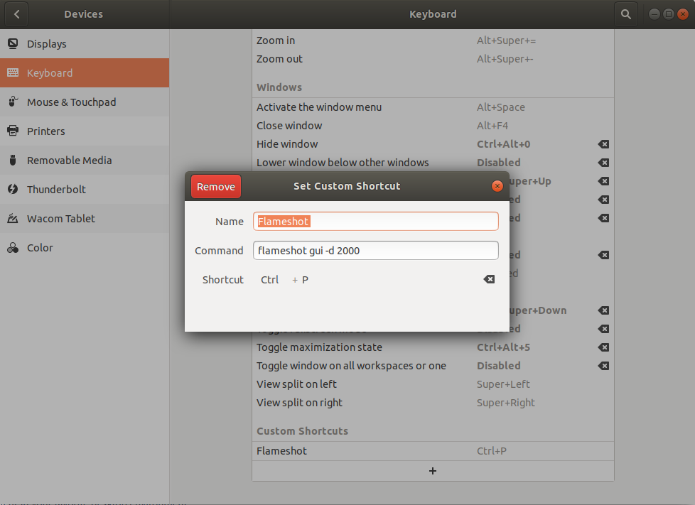

Create a new Directory in Downloads or any where else to store the packages or tar's, if any: 
```shell
$ cd Downloads
$ mkdir Apps
$ cd Apps
```

1. Installing Mozilla Firefox Manually- [Reference : Look for manualy install section](https://linuxconfig.org/how-to-install-uninstall-and-update-firefox-on-ubuntu-18-04-bionic-beaver-linux)

   a) Downlaod latest tar of Firefox from this [link](https://www.mozilla.org/en-US/firefox/download/thanks/)
   
   OR

   a) Use the following command to downlaod latest version of firefox automatically.
   ```shell
   $ wget -O firefox.tar.bz2 "https://download.mozilla.org/?product=firefox-latest&os=linux64&lang=en-US"
   ```

   b) Use the following commands.

  OR

1. Installing latest firefox automatically using packet manager
```shell
$ sudo apt-get install firefox 
```

2. Installing Spotify
```shell
$ sudo snap install spotify
```

3. Installing VLC
```shell
$ sudo snap install vlc
```
4. Installing 
Postman
```shell
$ sudo snap install postman
```

4. Installing 
Okular
```shell
$ sudo snap install okular
```

5. Installing Java : [Reference](https://lift.cs.princeton.edu/java/linux/)
```shell
$ sudo add-apt-repository ppa:openjdk-r/ppa
$ sudo apt-get update
$ sudo apt-get install openjdk-11-jdk
```
  Now check whether java is correctly installed
  ```shell
  $ javac -version
  javac 11.0.2
  $ java -version
  openjdk version "11.0.2" 2019-04-16
  OpenJDK Runtime Environment (build 11.0.2+7-Ubuntu)
  OpenJDK 64-Bit Server VM (build 11.0.2+7-Ubuntu, mixed mode, sharing)
  ```

6. Installing Jetbrains Font:
```shell
$ wget -O JetBrainsMono-1.0.3.zip https://download.jetbrains.com/fonts/JetBrainsMono-1.0.3.zip
$ sudo unzip JetBrainsMono-1.0.3.zip -d /usr/share/fonts
$ fc-cache -f -v
```
7. Installing Development tools:
```shell
$ sudo apt install build-essential
```

8. Installing nvm, node, yarn: [Reference](https://linuxize.com/post/how-to-install-node-js-on-ubuntu-18.04/)
```shell
$ curl -o- https://raw.githubusercontent.com/creationix/nvm/v0.34.0/install.sh | bash
```
This automatically installs nvm and puts the required command in "~/.bashrc" if you use something else like "ZSH" then you have to edit the "~/.zshrc" or respective yourself like this:
```shell
$ sudo nano ~/.zshrc
# Add the folowing lines and save the file with Ctrl+S and exit with Ctrl+Z:
export NVM_DIR="$HOME/.nvm"
[ -s "$NVM_DIR/nvm.sh" ] && \. "$NVM_DIR/nvm.sh"  # This loads nvm
[ -s "$NVM_DIR/bash_completion" ] && \. "$NVM_DIR/bash_completion"  # This loads nvm bash_completion
$ source ~/.zshrc
$ nvm --version
0.34.0
```
Now Let's install node and yarn
```shell
$ nvm install node
$ node --version
v14.0.0
$ curl -sS https://dl.yarnpkg.com/debian/pubkey.gpg | sudo apt-key add -
OK
$ echo "deb https://dl.yarnpkg.com/debian/ stable main" | sudo tee /etc/apt/sources.list.d/yarn.list
deb https://dl.yarnpkg.com/debian/ stable main
$ sudo apt update && sudo apt install yarn
```

9.  Installing Flameshot 
```shell
$ sudo apt-get install flameshot
```

Then configure, the short for taking screenshots using following:



10. Installing Tor Browser

a) Download tor from [tor](https://www.torproject.org/)
b) Foolow the steps [link](https://kernpanik.com/geekstuff/2015/01/04/tor-browser-with-icon.html)
```shell
$ cd /Downloads/Apps//tor-browser-linux64-9.0.9_en-US/tor-browser_en-US
$ sudo mv start-tor-browser.desktop /usr/share/applications
```

11. Installing Pomodoro
```shell
$ sudo apt-get install gnome-shell-pomodoro
```